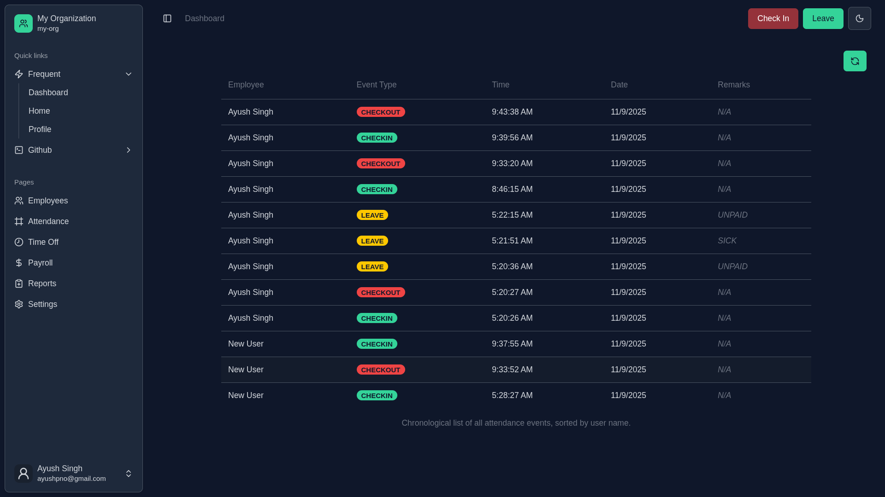

# 🧾 WorkZen - HR Payroll Management System

A modern **Role-Based Access Control (RBAC)** powered **HR & Payroll Management System** built using **React + Vite (client)** and **Hono + Drizzle ORM (server)** — containerized with **Docker** for easy deployment.  

This system helps organizations manage **attendance, payroll, leaves, and users** efficiently, all within a secure role-based environment.

---



## 🚀 Features

### 🔐 Role-Based Access Control (RBAC)
Four types of users with distinct permissions:
- **Admin** → Manage users, assign roles, oversee everything  
- **HR** → Manage attendance, leaves, and employee profiles  
- **Payroll Manager** → Process salaries, handle deductions, generate payroll reports  
- **Member (Employee)** → View payslips, apply leaves, track attendance  

### 🕒 Attendance Management
- Mark daily attendance  
- Track attendance logs 

### 💸 Payroll Management
- Compute gross and net salaries dynamically  
- Add deductions, bonuses, and tax calculations  
- Generate and download **PDF Payroll Reports**  using `react-to-pdf`  

### 🌴 Leave Management
- Members can apply for leaves  
- HR/Admin can approve or reject requests  

### 📊 Dashboard & Analytics
- Interactive charts and data insights via **Recharts**  
- Real-time performance and attendance data  

### 🧾 Reporting
- Export **PDF reports** for payroll and attendance  
- Clean, professional templates for documentation  

---

## 🧩 Tech Stack

### **Frontend (Client)**

| Technology | Purpose |
|-------------|----------|
| **React 19 (Vite)** | UI development |
| **Redux Toolkit** | State management |
| **React Router v7** | Frontend routing |
| **React Hook Form + Zod** | Form validation |
| **TailwindCSS + Radix UI** | Styling & components |
| **Recharts** | Analytics and charts |
| **React PDF / React-to-PDF** | PDF generation |
| **Sonner** | Toast notifications |
| **Lucide React** | Icons |
| **Next Themes** | Light/Dark theme support |

### **Backend (Server)**

| Technology | Purpose |
|-------------|----------|
| **Hono.js** | Lightweight API framework |
| **Drizzle ORM** | Type-safe database queries |
| **PostgreSQL** | Relational database |
| **Better Auth** | Authentication & authorization |
| **Resend** | Email notifications |
| **UUID** | Unique ID management |
| **Bun Runtime** | Fast, modern backend runtime |
| **Docker** | Postgres and Adminer |

---

### ⚙️ Local Development (Without Docker)
Frontend

```bash
cd client
bun install
bun dev
```

### Backend

```bash
cd hono
bun install
bun run dev
```

### Database Setup
```bash
bunx drizzle-kit generate
bunx drizzle-kit migrate
```

### 📈 Future Enhancements

🌍 Multi-language localization

📧 Automated payslip emailing

📅 Google Calendar integration for leaves

Crafter with ❤️ by Ayush Singh.